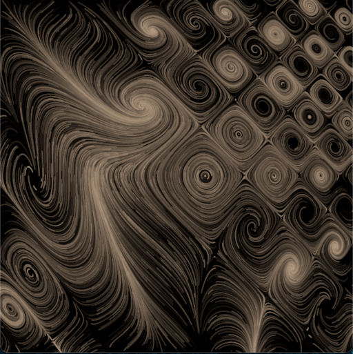
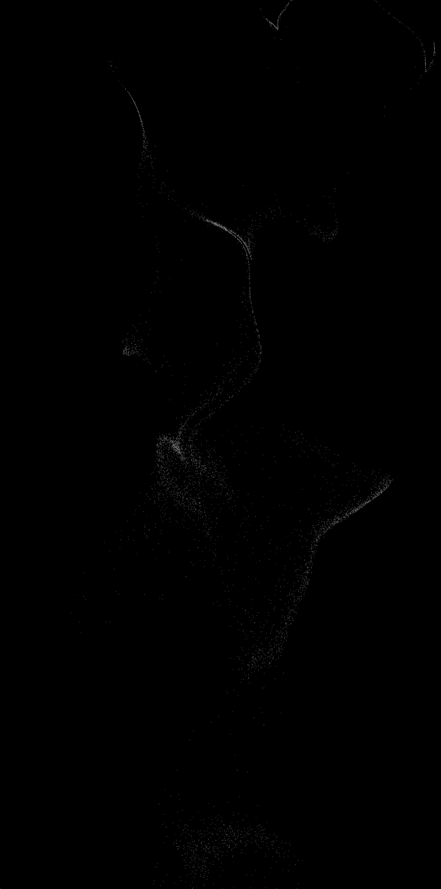
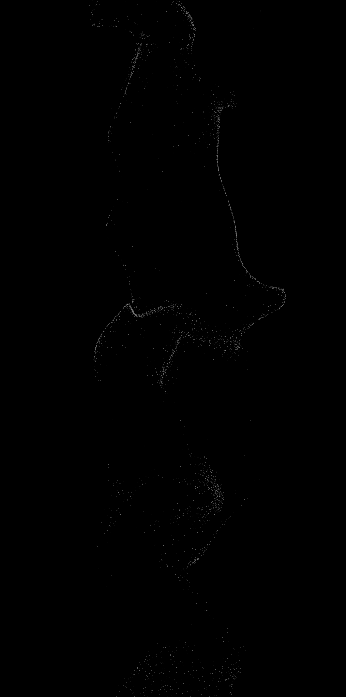

# nannou_app

## moving_points
Created based on the following video.

https://www.youtube.com/watch?v=Ml6tpyTyXhM&pp=ugMICgJqYRABGAE%3D

## moving_points2
This is an APP that changed the pattern of moving_point based on the following work.

https://twitter.com/yuruyurau/status/1588062547315679232

## perlin_noise
Study for understanding perlin noise.

Generate a two-dimensional force field using Perlin noise. Countless particles move in response to that force field.

