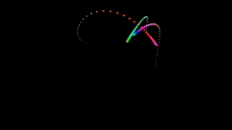

# nannou_app

## moving_points
This was created based on the following video:

Nannou: creative coding with Rust - GitHub Universe 2020: https://www.youtube.com/watch?v=Ml6tpyTyXhM&pp=ugMICgJqYRABGAE%3D

## moving_points2
This app changes the pattern of moving points based on the following work:

https://twitter.com/yuruyurau/status/1588062547315679232

## perlin_noise
This is a study for understanding Perlin noise. It generates a two-dimensional force field using Perlin noise and countless particles move in response to that force field.

## mandelbrot_set
This draws the Mandelbrot set and uses parallelization and wgpu for study.

## rotating
This is a 3D drawing. It draws a sequence of points moving on a spherical surface.

